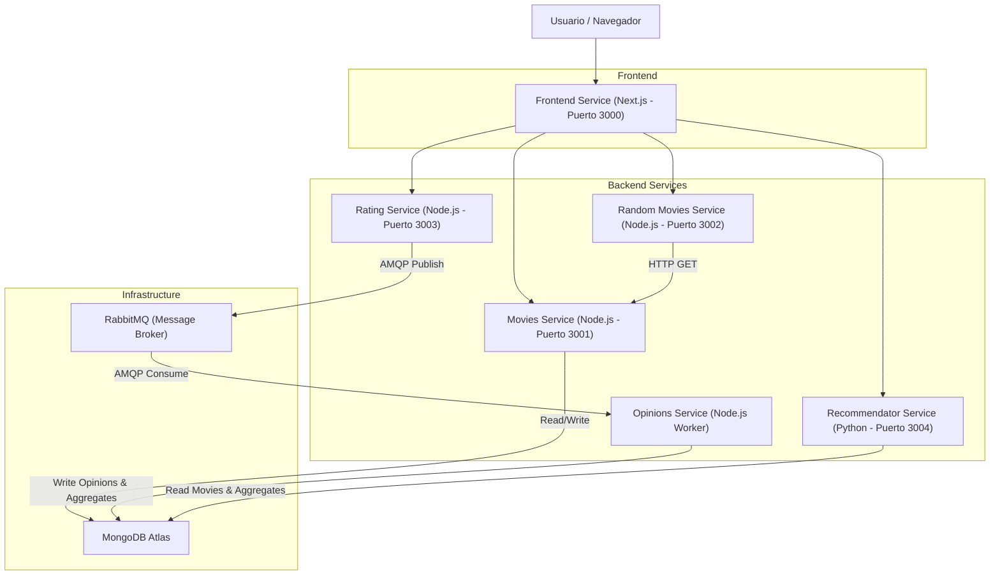

# Proyecto de Microservicios de Catálogo de Películas

Este proyecto es una aplicación de catálogo de películas basada en una arquitectura de microservicios. Utiliza Docker para la orquestación, MongoDB para la persistencia de datos y RabbitMQ para la comunicación asíncrona entre servicios.

## Instrucciones especiales para el correcto funcionamiento

Crear un archivo `.env` cuyo contenido sea la clave privada llamada MONGO_URI que fue entregada a la cátedra mediante la entrega de Moodle, junto al enlace de este repositorio.
Este mismo archivo debe estar presente en los siguientes subdirectorios: 
- [movies-service](/movies-service)
- [opinions-service](/opinions-service)
- [recommendator-service](/recommendator-service)

## Arquitectura del Sistema

El sistema está compuesto por varios microservicios que trabajan en conjunto. A continuación se muestra un diagrama de cómo interactúan entre sí y con los servicios de infraestructura (MongoDB y RabbitMQ).



## Descripción de Microservicios

### 1. Frontend Service
- **Tecnología:** Next.js (React)
- **Puerto:** 3000
- **Descripción:** La interfaz de usuario principal. Permite a los usuarios navegar por el catálogo de películas, ver detalles, calificar películas y recibir recomendaciones.

### 2. Movies Service
- **Tecnología:** Node.js, Express, TypeScript
- **Puerto:** 3001
- **Descripción:** El servicio central que gestiona el catálogo de películas. Proporciona endpoints para buscar películas por ID, título, director, etc. Se conecta directamente a MongoDB para recuperar la información de las películas.

### 3. Random Movies Service
- **Tecnología:** Node.js, Express, TypeScript
- **Puerto:** 3002
- **Descripción:** Proporciona una selección aleatoria de películas. Funciona como un "proxy" inteligente que solicita información al `Movies Service` para obtener los detalles de las películas seleccionadas aleatoriamente.

### 4. Rating Service
- **Tecnología:** Node.js, Express, TypeScript
- **Puerto:** 3003
- **Descripción:** Recibe las calificaciones y reseñas de los usuarios. En lugar de escribir directamente en la base de datos, publica estos eventos en una cola de mensajes de RabbitMQ para ser procesados asíncronamente, garantizando una alta disponibilidad y baja latencia en la respuesta al usuario.

### 5. Opinions Service
- **Tecnología:** Node.js, TypeScript (Worker)
- **Puerto:** N/A (Interno)
- **Descripción:** Un servicio "worker" que escucha la cola de RabbitMQ. Procesa las calificaciones entrantes, las guarda en la colección de `opinions` en MongoDB y actualiza los agregados de calificaciones (promedio y conteo total) en la colección `movieaggregates`.

### 6. Recommendator Service
- **Tecnología:** Python, Flask
- **Puerto:** 3004 (Mapeado internamente al 5000)
- **Descripción:** Motor de recomendaciones que utiliza algoritmos de procesamiento de lenguaje natural (TF-IDF) y similitud de metadatos (género, elenco, director) para sugerir películas relevantes basadas en las películas mejor valoradas.

## Requisitos Previos

Para ejecutar este proyecto, necesitas tener instalado:

- **Docker Desktop** (incluye Docker Compose)
- **Git**

## Instalación y Ejecución

1. **Clonar el repositorio:**
   ```bash
   git clone <url-del-repositorio>
   cd proyecto-topicos-2025
   ```

2. **Configurar Variables de Entorno:**
   Asegúrate de que los archivos `.env` o los secretos de Docker estén configurados correctamente, especialmente la conexión a MongoDB Atlas si se utiliza una base de datos en la nube.
   
   *Nota: El proyecto utiliza `docker secrets` para gestionar las credenciales en algunos servicios.*

3. **Construir y Levantar los Servicios:**
   Ejecuta el siguiente comando en la raíz del proyecto:
   ```bash
   docker-compose up --build
   ```
   
   Esto descargará las imágenes necesarias, construirá los microservicios y levantará todo el entorno.

4. **Verificar la Ejecución:**
   Una vez que todos los servicios estén arriba, puedes acceder a:
   - **Frontend:** [http://localhost:3000](http://localhost:3000)
   - **RabbitMQ Management:** [http://localhost:15672](http://localhost:15672) (Usuario/Pass por defecto: guest/guest)

## Uso

1. Abre tu navegador en [http://localhost:3000](http://localhost:3000).
2. Navega por la lista de películas.
3. Haz clic en una película para ver sus detalles.
4. Deja una calificación (1-5 estrellas) y un comentario. Esto enviará un mensaje a través de RabbitMQ.
5. Observa cómo la sección de "Recomendados" sugiere títulos basados en el contenido.
